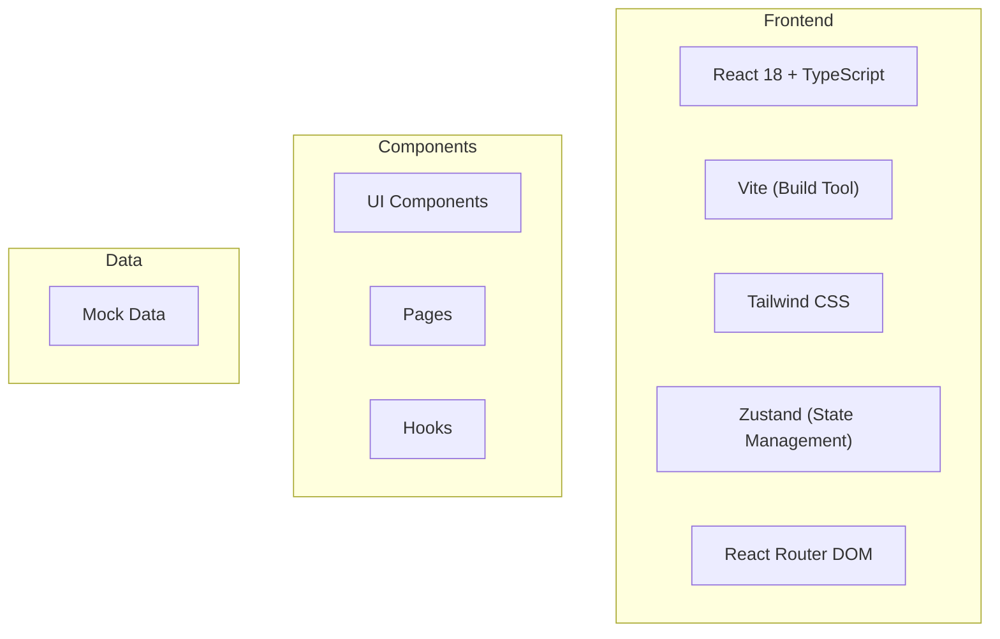

## 1. Architecture Design



## 2. Technology Description
- **Frontend**: React@18 + TypeScript + Vite + Tailwind CSS + Zustand + React Router DOM
- **Initialization Tool**: vite-init with react-ts template
- **Backend**: None (Frontend-only with mock data)
- **Database**: Mock data in memory

## 3. Route Definitions
| Route | Purpose |
|-------|---------|
| / | Landing Page |
| /services | Services Page |
| /portfolio | Portfolio Page |
| /booking | Booking Flow (3 steps) |
| /login | Login/Signup Page |
| /dashboard | User Dashboard |
| /confirmation | Confirmation Page |

## 4. Data Model

### 4.1 Data Types
```typescript
interface Service {
  id: string;
  name: string;
  description: string;
  price: number;
  duration: number;
  image: string;
  category: string;
}

interface Stylist {
  id: string;
  name: string;
  avatar: string;
  rating: number;
  specialty: string[];
  availableSlots: string[];
}

interface Booking {
  id: string;
  services: Service[];
  stylist: Stylist;
  date: string;
  time: string;
  customerName: string;
  customerPhone: string;
  customerEmail: string;
  totalPrice: number;
}

interface PortfolioItem {
  id: string;
  image: string;
  tags: string[];
  stylistId: string;
}

interface User {
  id: string;
  name: string;
  email: string;
  avatar?: string;
  phone: string;
}
```
