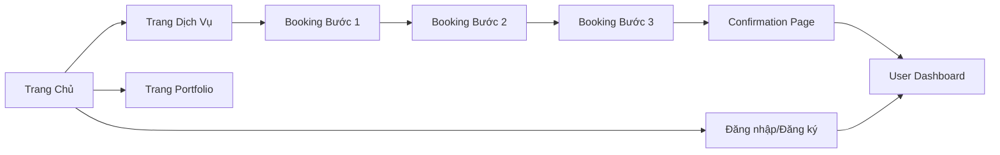

## 1. Product Overview

Hypershop là một ứng dụng đặt lịch salon chuyên nghiệp, giúp khách hàng dễ dàng khám phá dịch vụ, xem portfolio, lựa chọn stylist và đặt lịch hẹn trực tuyến. Mục tiêu là tạo trải nghiệm người dùng hiện đại, sang trọng và tiện lợi.

## 2. Core Features

### 2.1 User Roles
| Role | Registration Method | Core Permissions |
|------|---------------------|------------------|
| Khách hàng | Email/Google/Facebook | Đặt lịch, xem dịch vụ, portfolio, quản lý tài khoản cá nhân |

### 2.2 Feature Module
1. **Trang Chủ**: Hero, dịch vụ nổi bật, portfolio, stylist, testimonial
2. **Trang Dịch Vụ**: Filter, service cards, chi tiết dịch vụ
3. **Trang Portfolio**: Category tabs, masonry grid, filter by stylist
4. **Booking Flow (3 bước)**: Chọn dịch vụ, chọn stylist & thời gian, xác nhận
5. **Đăng nhập/Đăng ký**: Form login, social login, forgot password
6. **User Dashboard**: Lịch hẹn, thông tin cá nhân, yêu thích, đánh giá
7. **Confirmation Page**: Mã booking, add to calendar, share

### 2.3 Page Details
| Page Name | Module Name | Feature description |
|-----------|-------------|---------------------|
| Landing Page | Hero Section | Hình ảnh salon chất lượng cao, tagline "Biến đổi phong cách của bạn" |
| Landing Page | Dịch vụ nổi bật | Grid 3-4 dịch vụ chính với hình ảnh |
| Landing Page | Portfolio preview | Carousel hình ảnh mẫu tóc thành công |
| Landing Page | Starlist nổi bật | Giới thiệu stylist top với đánh giá |
| Trang Dịch Vụ | Filter sidebar | Lọc theo loại, giá, thời gian |
| Trang Dịch Vụ | Service cards | Mỗi card có hình ảnh, tên, mô tả, thời gian, giá |
| Booking Flow - Bước 1 | Chọn dịch vụ | Checkbox, tổng thời gian & giá ước tính |
| Booking Flow - Bước 2 | Chọn stylist & thời gian | Calendar view, time slots |
| Booking Flow - Bước 3 | Thông tin & xác nhận | Form, tổng kết, payment option |
| User Dashboard | Lịch hẹn | Upcoming & past appointments |
| Confirmation Page | Mã booking | QR code, add to calendar, share |

## 3. Core Process

Người dùng truy cập → Khám phá trang chủ → Chọn dịch vụ → Đặt lịch (3 bước) → Xác nhận thành công → Đăng nhập để quản lý lịch hẹn.

## 4. User Interface Design

### 4.1 Design Style
- **Màu sắc chính**: Deep Purple/Navy (#4A3AFF)
- **Màu phụ**: Soft Pink/Gold (#FF9A8B)
- **Màu nhấn**: Teal (#2DD4BF)
- **Nền trung tính**: White, Light Gray (#F8FAFC), Dark Gray (#1E293B)
- **Font chữ**: Inter/SF Pro (Headings - Bold, Body - Readable)
- **Layout**: Card-based, sticky header
- **Nút**: Bo góc, hover states nhất quán
- **Icon**: Lucide React

### 4.2 Page Design Overview
| Page Name | Module Name | UI Elements |
|-----------|-------------|-------------|
| Landing Page | Hero | Gradient background, large typography, CTA button |
| Landing Page | Service Cards | Image, title, description, price, CTA |
| Landing Page | Portfolio Carousel | Swipeable images with tags |
| Trang Dịch Vụ | Filter Sidebar | Checkboxes, sliders, accordion |
| Booking Flow | Steps | Progress bar, step indicators, form sections |
| User Dashboard | Tabs | Tab navigation, content sections, action buttons |

### 4.3 Responsiveness
- Desktop-first design, fully responsive
- Mobile: Hamburger menu, bottom navigation, full-screen modals
- Touch-optimized interactions

### 4.4 Interactive States
- **Hover**: Service cards scale up, buttons color change, nav items underline
- **Loading**: Skeleton screens, spinner, progress bar
- **Success/Error**: Toast notifications, form validation, confirmation animations
